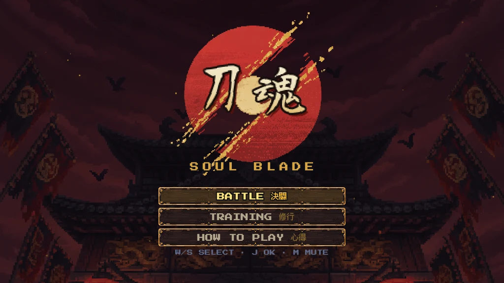
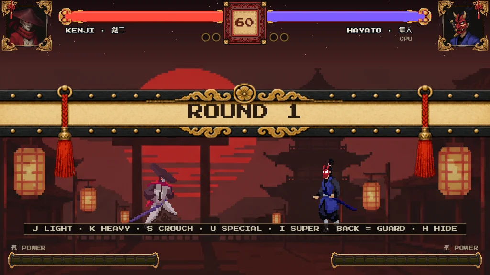
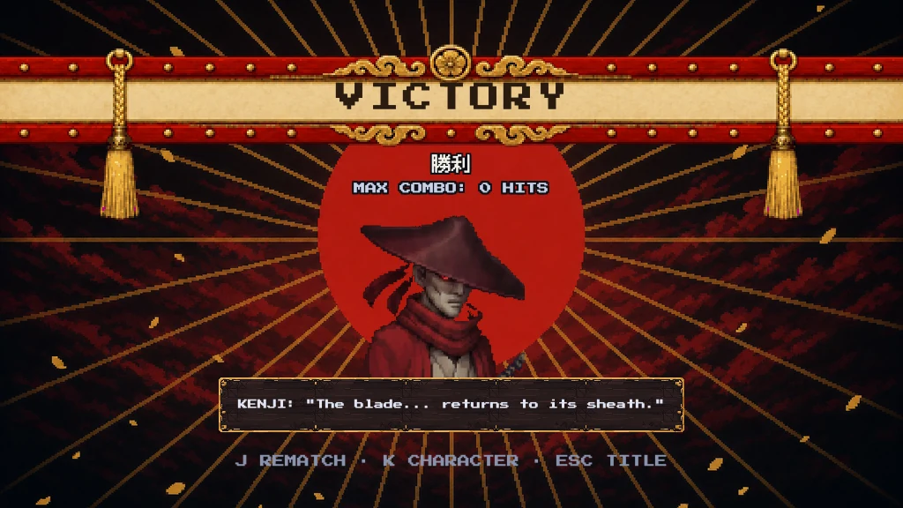
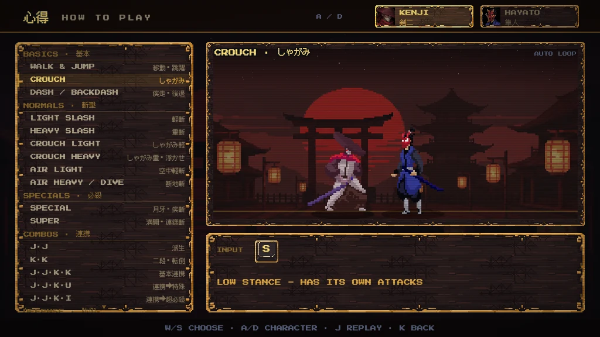

# 刀魂 SOUL BLADE

KOF 风格的和风像素格斗游戏 —— 纯 vanilla JS + Canvas,**零依赖、零构建**,首屏 ~12MB。
人机对战,2 个可选角色,完整格斗机制(连锁/方向格挡/护条破防/浮空连段/超必演出)+ 练习场 + 招式图鉴。

🎮 在线试玩:https://soul-blade.pages.dev (需要电脑 + 键盘操作)





## 运行

```bash
python3 serve.py          # http://localhost:8787(开发用,带 no-store 头)
```

或任意静态服务器伺服本目录。

## 键位

| 键 | 功能 |
|---|---|
| A / D | 左右移动(空中可漂移转向) |
| W | 跳跃(带方向起跳;冲刺/后撤中也可跳) |
| 按住后方向 | **格挡(KOF 式方向防御)**:命中一刻须按住远离敌人的方向;出招/跳/冲刺/蹲中防不了;格挡积累**护条**,满 100 破防大硬直;绕背可破 |
| S | 下蹲:蹲 J = 低位削足(可连打);蹲 K = 挑空升斩(可接超必) |
| J / K | 轻击 / 重击(连按来回变招;空中 K = 下坠重砸) |
| U | 必杀技(独立冷却):剣二 = 突进斩,隼人 = 手裏剣(命中确认可接超必) |
| I | 超必杀(气槽满 100,带演出) |
| 双击 D / A | 前冲刺(可取消进攻击)/ 后撤闪避(起手无敌帧) |
| Esc / P · M · H | 暂停 · 静音 · 隐藏提示 |
| T / R | 练习场:木桩三态切换 / 复位 |

标题菜单选 HOW TO PLAY(或暂停菜单按 K)可打开**招式图鉴**:左侧全招式表,右侧真引擎实时演示。



## 角色

- **剣二 KENJI**(力量型武士 · 红):重剑大伤害,一套连段定胜负。
- **隼人 HAYATO**(速度型忍者 · 蓝):移速与手长占优,手裏剣立回牵制,瞬身背刺超必。

**基础连招**:`J → J → K` 起手,收尾三选一:`K`(击倒终结,剣二 31 / 隼人 30)、`U`(剣二限定,32)、`I`(超必收尾,双方 46)。蹲 K 挑空后可接空中追击(上限 1 次)或直接接超必。3 hit 及以后的连锁招享 ×1.3 终结加成,整体带伤害衰减。

## 机制清单

方向格挡 + chip 伤害 + 护条破防 · 链式取消连招 + 伤害衰减 · 浮空连段(空中追击上限 1)·
必杀冷却 + 气槽(打击/受击/格挡攒气)· 超必暗屏演出 · 击倒/起身无敌 · hitstop/屏震/慢镜 KO ·
回合制 BO3(60 秒计时 / TIME UP / PERFECT / DOUBLE K.O.)· AI 三档难度(困难 = 读指令的 SNK Boss 式鬼级)·
练习场(木桩三态 / 无限气 / 自动回血)· 180ms 输入缓冲(高刷屏不吃键)。

音频:音效为 WebAudio 实时合成;BGM 为 AI 生成的和风器乐(mp3,逐场景切换,无缝循环)。

## 开发工具页(仓库自带)

`anim-lab.html` 动作实验室(真引擎逐帧/判定框)· `hitbox-lab.html` 判定编辑器 ·
`ui-lab.html` UI 资产库 · `sfx-lab.html` / `bgm-lab.html` 音频试听台 · 其余 *-lab.html 为设计对比页。

## 调试参数

`?fight=1&p1=mack&p2=kenji&ai=hard` 直进战斗 · `&demo=1` 双 AI 观战 · `&debug=1` 判定框 ·
`&training=1` 练习场 · `?screen=controls` 图鉴 · `?loaddelay=200` 慢放加载页

## 素材与授权

角色像素素材来自 [LuizMelo](https://luizmelo.itch.io/) 的开源 CC0 资源;UI/场景/横幅/结算画面与 BGM 为 AI 生成;字体为 OFL / 免费商用授权。详见 [CREDITS.md](CREDITS.md)。
